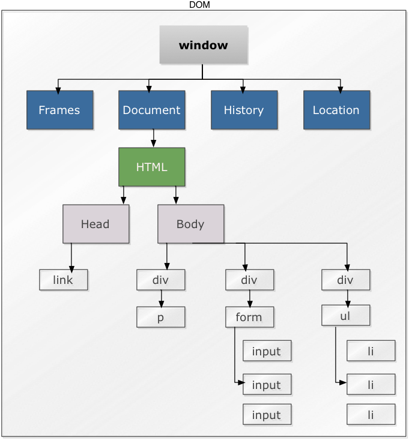

# Intro To Javascript

## Beginning Javascript
Javascript (JS) is an interpreted computer programming language, it's primary use is in web browsers to allow control of the browser, asynchronous communication, and to alter document content. JavaScript copies many names and naming conventions from [Java](http://en.wikipedia.org/wiki/Java_(programming_language)), but the two languages are otherwise unrelated and have very different semantics. Javascript has other uses and applications including use in desktop applications, PDF's, and server-side applications (i.e. [Node.js](http://nodejs.org)), but we will be focusing primarily on JS in the browser.

### DOM Manipulation
To understand how we can utilize JS in the web browser we should understand the Document Object Model (DOM). The DOM is a way to model all of the elements within a browser page. The DOM tree represent all of the element inside of the DOM. Here is a diagram of how we can visualize the DOM, there is a lot missing here, but the basic concept is highlighted.

Javascript allows us to select, inspect, append, modify, and delete elements within the DOM. For example we could change the `<li>` elements in the above example.

    document.getElementsByTagName('ul')[0].innerHTML = "";

or

    var node = document.getElementsByTagName('ul')[0];
    while (node.firstChild) {
        node.removeChild(node.firstChild);
    }

Javascript executed by a browser affects our current DOM, when the page is reloaded a new DOM will be created and our changes will not persist. Some common and practical uses of DOM manipulation could be:

- When entering billing and shipping information, copying the values of inputs from the billing form to the shipping form
- Showing and hiding a drop-down menu in a navigation bar
- Changing images displayed in a slideshow type element based on a timer.

### DOM Events

DOM Manipulation happens when different events take place, DOM events can be very complex, but there is a slew of them that are very easy to grasp and even understand by their name alone.

- onClick (happens when we click an element)
- onMouseOver (when the mouse goes over an element)
- scroll (when we scroll the page)

We can bind events to specific elements. Such as:

    document.getElementById("link").onclick = function(event) {
      alert("I've clicked the link")
    }
Events can also be bound inline with HTML:

    <a href='/some/path' onclick="someJsFunction()">

### AJAX

AJAX (Asynchronous JavaScript and XML) is a technique used to send and request data from a server from the client-side. This allows us to send information in the current DOM to a server, get a response, and modify the current DOM with the response to avoid a full-page reload. XML is in the acronym for AJAX, but is not required, JSON is often used as the data type in communication.

## jQuery

jQuery is a Javascript library designed to simplify the client-side scripting of HTML. jQuery is free, open source software that has been widely adopted by over 1/2 of website on the internet today. jQuery is so popular because it's designed to make DOM manipulation, handling events, AJAX, and even animations. jQuery also a provides a structure that is easily expandable, allowing developers to write modular plug-ins for use on different applications.

##CS Fundamentals - Part 4

###Lesson

#### Data Structures

Hash Tables

#### Algorithms

TODO
