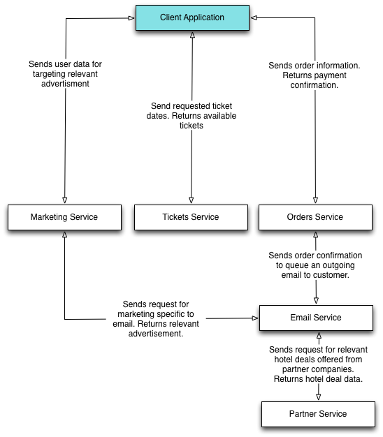

# Service Oriented Architecture

Service Oriented Architecture is a software design principle based modular collections of applications, known as services, that communicate with each other to provide the complete functionality of a larger software system.

The above exmaple relies on 6 seperate services for the process of a customer purchasing a ticket. The benefits are that:

- Simultaneous requests. The tickets and marketing need to be displayed on a single page, if these concepts we're in one big application, the same server would have to spend time computing the logic.
- Reuse. As we can see the Client Application and the Email Service both use the marketing service.
- Modularity. It's easy to add and remove features without changing a ton of logic, if we wanted to add the Partners Service the Client Application, it would be very easy since our applications already have a way of communicating with the service.
- Performance. Smaller code bases and less code to run improves the performance of each individual service.
- Simplicity. Each application can stay small and focused. Do one thing well.

## Project

Build the ticketing service outlined above

##CS Fundamentals - Part 5

###Lesson

#### Data Structures

Singly Linked Lists

#### Algorithms

TODO
